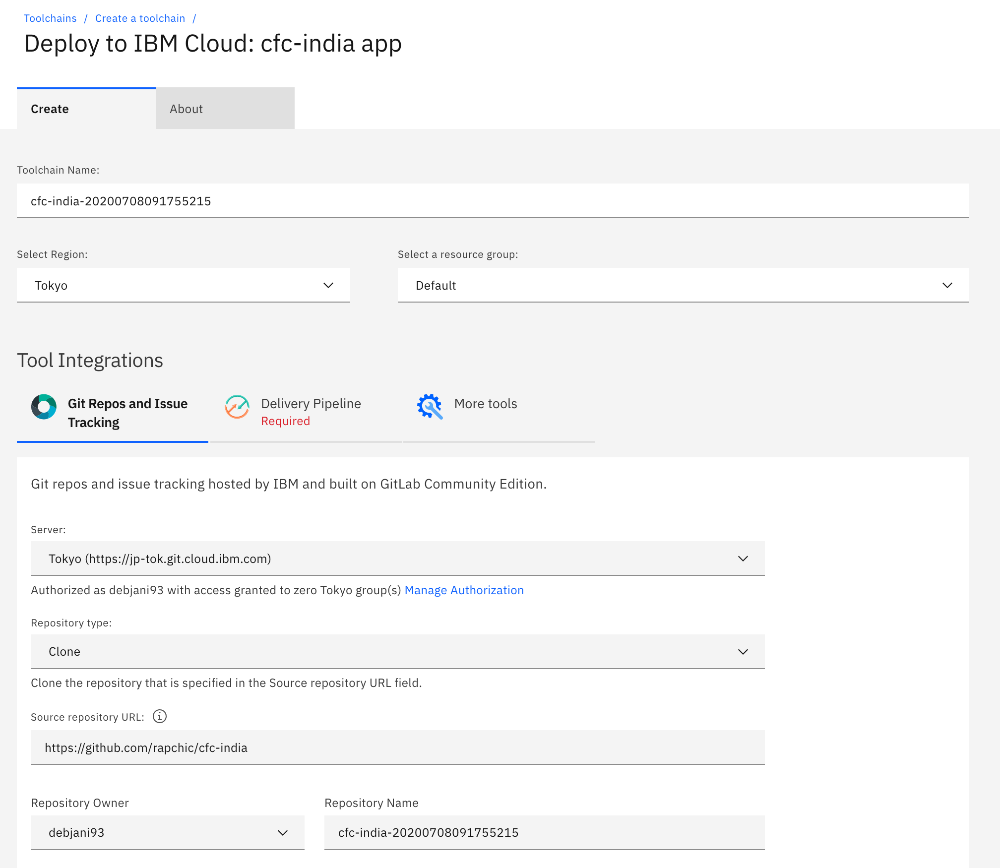
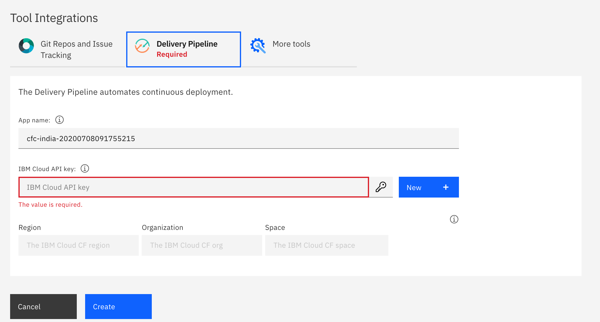
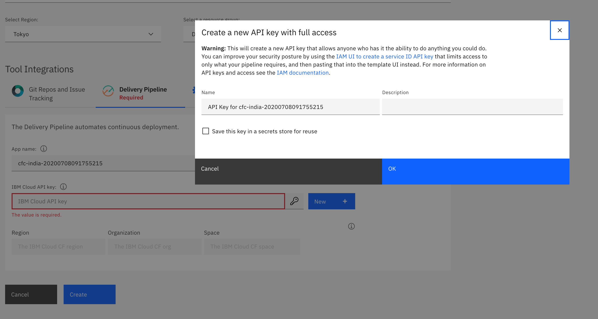

# Node.js Thank you for your registration

This application demonstrates a simple, reusable Node.js web application based on the Express framework.

## Run the app locally

1. [Install Node.js][]
1. cd into this project's root directory
1. Run `npm install` to install the app's dependencies
1. Run `npm start` to start the app
1. Access the running app in a browser at <http://localhost:6001>

[Install Node.js]: https://nodejs.org/en/download/

## Deploy to IBM Cloud

<a href="https://cloud.ibm.com/devops/setup/deploy?repository=https://github.com/rapchic/cfc-india&branch=master"></a>

## Run the app on IBM Cloud

1. Fork the repo.
2. To create a Deploy to IBM Cloud button, copy and modify one of the following snippet templates. Specify your Git repository and branch in the URL.
```
<a href="https://cloud.ibm.com/devops/setup/deploy?repository=<git_repository_URL>&branch=<git_branch>"></a>
```


2. Check the details, on this page.



3. Create an API key


